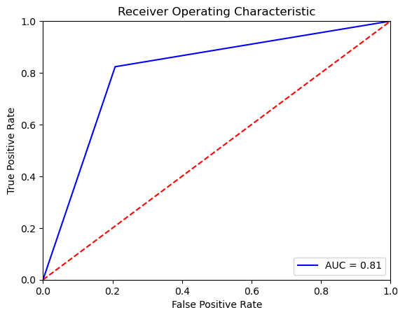

# Homework 3

两问均为分类问题，第一题为多分类，第二题为二分类。

对第一题在尝试了`LogisticRegression` , `RandomForestClassifier`, ` SVC`, 由`DecisionTreeClassifier`组成的` BaggingClassifier`, 以及不同模型组成的`VotingClassifier`. 发现`RandomForestClassifier`相比之下效果较好且较为简单。于是选择`RandomForestClassifier`对其进行调参并拟合和预测。

## Homework 3-1

1. 导入数据并归一化处理

2. 使用`GridSearchCV`对`RandomForestClassifier`调节参数，评价函数取RMSE的负值。得到：

   ```python
   {'max_features': 15, 'n_estimators': 300}
   Lowest RMSE:0.764752
   ```

3. 选取最佳参数进行训练并预测。对测试集评估得到：

   ```python
   Prediction RMSE: 0.443
   ```

## Homework 3-2
1. 导入数据并归一化处理

2. 使用`GridSearchCV`对`RandomForestClassifier`调节参数，评价函数取AUC。得到：

   ```python
   {'max_features': 2, 'n_estimators': 220}
   best AUC:0.858329
   ```

3. 选取最佳参数进行训练并预测。将结果绘图得到：

